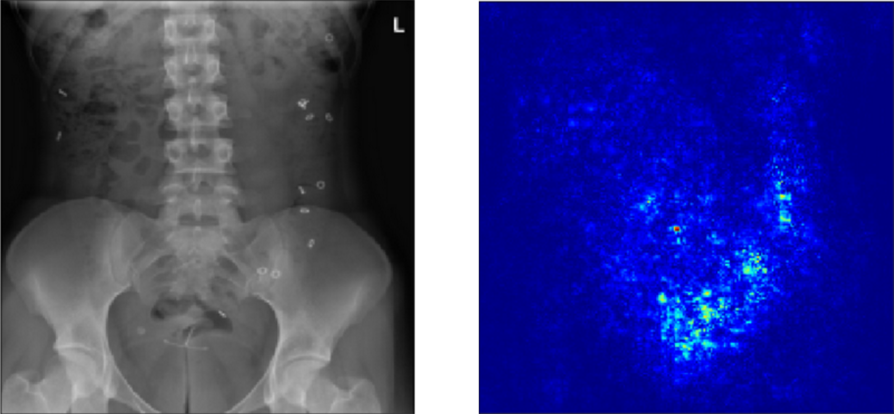
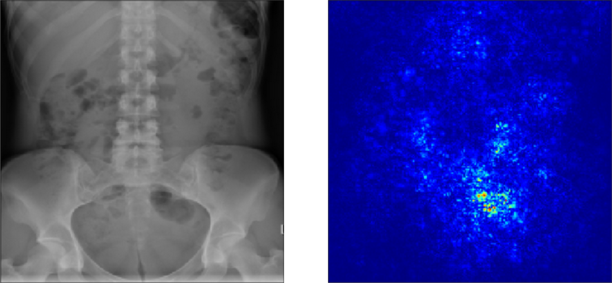
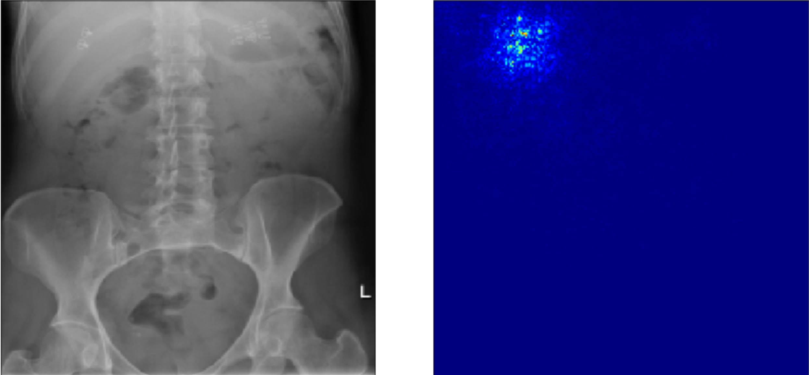
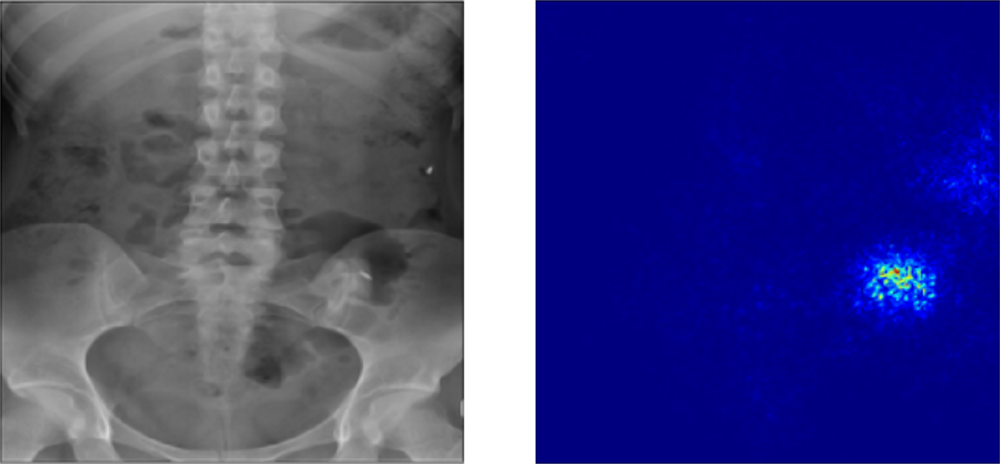
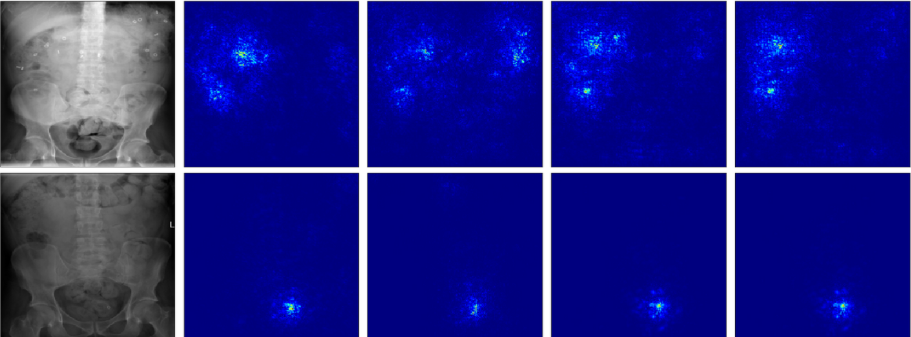
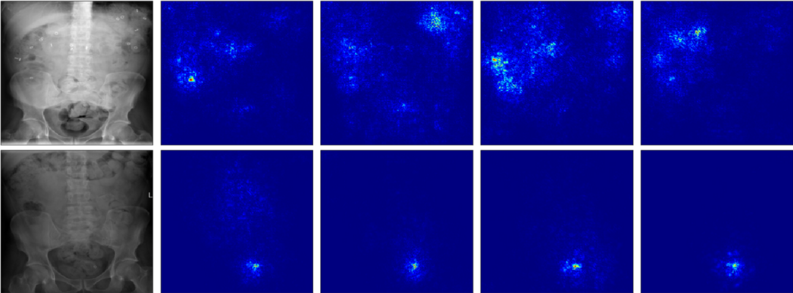
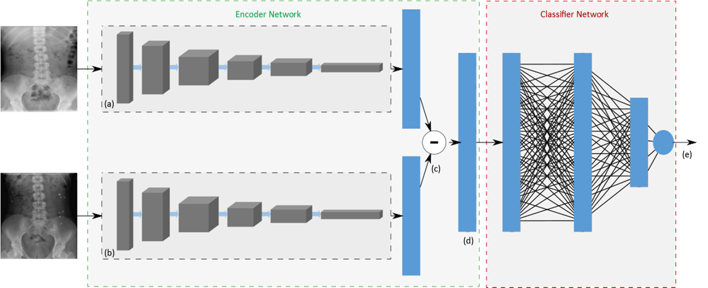
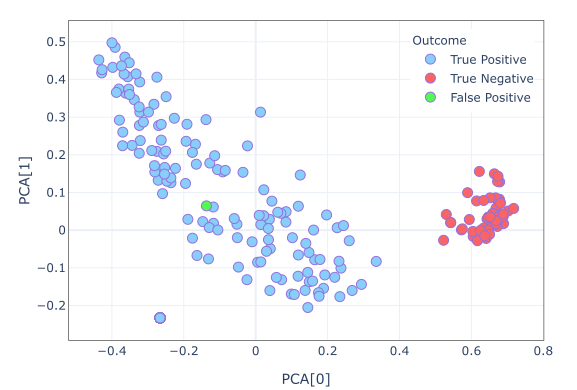

# Colonic Transit

## Saliency Maps
- True Positive case : positive_example.png
 

- True Negative case : negative_example.png

- False Positive case : false_positive_example.png

- False Negative case : false_negative_example.png

- Biased Training - all predictions incorrect 

- Balanced Training - all predictions correct

## Network Diagrams

- Siamese Classifier

## Figures
PCA evaluation of feature vector

- PCA Figure

